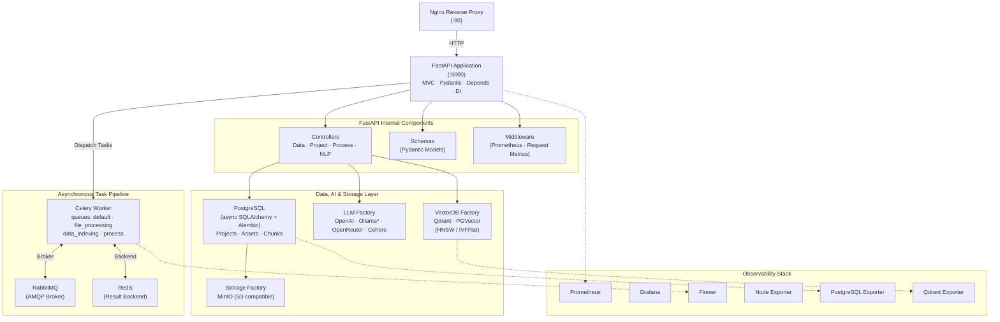

<div align="center">

# RagFlow

**A production-grade Retrieval-Augmented Generation (RAG) platform**  
built with clean architecture, multi-provider LLM support, dual vector stores, a distributed task queue, and a full observability stack.

[](https://python.org)
[](https://fastapi.tiangolo.com)
[](https://docker.com)
[](https://postgresql.org)
[](https://qdrant.tech)
[](https://min.io)
[](https://docs.celeryq.dev)
[](https://rabbitmq.com)
[](https://redis.io)
[](https://prometheus.io)
[](https://grafana.com)
[](https://nginx.org)
[](https://github.com/0xAgamy/RAG_mini/actions/workflows/tests.yml)
[](LICENSE)

[Features](#-features) · [Architecture](#-architecture) · [RAG Pipeline](#-rag-pipeline) · [API](#-api-reference) · [Quick Start](#-quick-start) · [Configuration](#-configuration) · [Monitoring](#-monitoring)

</div>

## 📌 Overview

RagFlow is a fully containerised, production-ready RAG system that lets you ingest documents, embed them into a vector store, and query them using natural language — powered by your choice of LLM provider, vector database, and object storage.

Built with **MVC architecture**, **Factory Design Patterns**, a **Celery distributed task pipeline**, and a complete **Prometheus + Grafana observability stack**, this is not a notebook demo — it is a deployable backend service.

**Everything is pluggable through configuration:** swap the LLM provider (OpenAI / Ollama / OpenRouter-compatible), the vector store (Qdrant / PGVector), the object storage (MinIO), the task broker (RabbitMQ), and the language of the prompt templates — with zero code changes.

---

## ✨ Features

- **Multi-provider LLM support** — OpenAI, Ollama, and any OpenAI-compatible gateway (OpenRouter, vLLM, LiteLLM) plus Cohere, switchable at runtime with zero code changes
- **Dual vector store support** — Qdrant and PGVector (PostgreSQL), switchable via configuration
- **Distributed task pipeline** — Celery workers with dedicated queues for file processing, indexing, and the end-to-end workflow
- **Chained RAG workflows** — process → index in a single Celery `chain`, so the whole pipeline runs asynchronously
- **Object storage abstraction** — MinIO-backed document storage behind a `StorageProviderFactory`
- **HNSW / IVFFlat indexing** — optimised vector search with batch embedding and indexing
- **MVC architecture** — clean separation of Controllers, Services, Schemas, and Models
- **Factory Design Pattern** — for LLM providers, Vector DB backends, and storage providers
- **Multilingual template parser** — dynamic prompt templates with `en` and `ar` locales
- **Async throughout** — FastAPI + async SQLAlchemy + Motor (async MongoDB driver)
- **Database migrations** — Alembic-managed schema versioning, auto-applied on container start
- **Full observability** — Prometheus metrics, Grafana dashboards, Flower task monitoring, Nginx reverse proxy, Postgres Exporter, Node Exporter
- **Security-first** — file content validation (not just extension), no internal exposure of sensitive configs
- **Chunked file uploads** — with aiofiles for non-blocking I/O
- **Retries & fault tolerance** — automatic Celery retries with exponential backoff, `acks_late`, broker connection retries
- **Dynamic asset management** — assets collection with MongoDB indexing (in v1) and PostgreSQL JSONB storage

---

## 🏗 Architecture



\* Ollama and OpenRouter are reached through the OpenAI provider's `OPENAI_API_URL`
base URL — point it at `http://localhost:11434/v1` (Ollama) or
`https://openrouter.ai/api/v1` and any Ollama/OpenRouter model becomes available
without writing a new provider.

---

## 🔄 RAG Pipeline

```
 1. UPLOAD                2. PROCESS              3. INDEX              4. QUERY
┌──────────────┐        ┌──────────────┐        ┌──────────────┐      ┌──────────────┐
│ POST         │        │ Celery task: │        │ Celery task: │      │ POST         │
│ /data/upload │──────▶ │ file_process │──────▶ │ data_index   │────▶ │ /nlp/index/  │
│ /{project_id}│        │ _ing         │        │ ing          │      │ ask/{id}     │
└──────┬───────┘        └──────┬───────┘        └──────┬───────┘      └──────┬───────┘
       │                       │                       │                     │
 Validate                MinIO download            Embed chunks          Embed query
 type + size             Load → split into         Batch embed +          Search top-k
       │                 chunks (recursive         HNSW insert           vectors
 Store in MinIO          char splitter)            into collection        │
       │                       │                       │                     │
 Insert Asset          Insert DataChunk          collection_<size>_     Build prompt
 row in Postgres       rows in Postgres           <project_id>           from locale
                                                                       template
                                                                              │
                                                            Generate answer ◀──┘
                                                            (LLM provider)
```

**Key points**

- Steps 2 and 3 are **queued and asynchronous** — the API returns a Celery `task_id` immediately.
- `/data/process-and-push/{project_id}` runs both as a single Celery `chain`, so indexing starts
  automatically the moment processing finishes.
- Each project gets an **isolated vector collection** named `collection_<embedding_size>_<project_id>`.
- `do_reset=1` drops the project's collection and chunks before re-ingesting.
- Prompt templates are resolved per locale (`DEFAULT_LANGUAGE`, currently `en` / `ar`).

---

## 🛠 Tech Stack

| Layer | Technology |
|---|---|
| **API Framework** | FastAPI, Pydantic v2, Pydantic-Settings, Uvicorn |
| **Async I/O** | aiofiles, asyncio, async SQLAlchemy |
| **Task Queue** | Celery, Flower |
| **Message Broker** | RabbitMQ |
| **Result Backend** | Redis |
| **LLM Providers** | OpenAI (incl. Ollama / OpenRouter-compatible), Cohere |
| **Document Processing** | LangChain, LangChain Text Splitters, PyMuPDF |
| **Vector Stores** | Qdrant, PGVector (PostgreSQL extension) |
| **Relational DB** | PostgreSQL + SQLAlchemy + Alembic |
| **Object Storage** | MinIO (S3-compatible) |
| **Vector Indexing** | HNSW, IVFFlat (Hierarchical Navigable Small World) |
| **Reverse Proxy** | Nginx |
| **Observability** | Prometheus, Grafana, Postgres Exporter, Node Exporter, Flower |
| **Containerisation** | Docker, Docker Compose |
| **Package Manager** | uv (in image), pip (local) |
| **Design Patterns** | Factory, MVC, Dependency Injection, ABC Interface, Strategy |
| **Testing** | pytest, httpx (fully mocked — no live services required) |

---


## 🚀 Quick Start

### Requirements

- Docker + Docker Compose
- Python 3.13+ (only if you want to run the app outside Docker)
- A free port set: `80`, `8000`, `5400`, `3000`, `5000`, `5672`, `6333`, `6379`, `9000`, `9001`, `9090`, `9100`, `9187`, `15672`

### 1. Clone the repository

```bash
git clone https://github.com/0xAgamy/RAG_mini.git
cd RAG_mini
```

### 2. Install the Python packages (optional — for local development)

```bash
pip install -r src/requirements.txt
```

### 3. Set up the local environment variables

```bash
cd src
cp .env.example .env
# add your OPENAI_API_KEY / COHERE_API_KEY, and point the services at localhost
```

### 4. Create the Docker environment files

```bash
cd docker/env
cp .env.example.app            .env.app
cp .env.example.postgres       .env.postgres
cp .env.example.grafana        .env.grafana
cp .env.example.postgres-exporter .env.postgres-exporter
cp .env.example.rabbitmq       .env.rabbitmq
cp .env.example.redis          .env.redis
```

### 5. Start the stack

```bash
cd docker
docker compose up --build -d
```

The first build takes a few minutes (PyMuPDF and the scientific wheels are large).
`entrypoint.sh` runs `alembic upgrade head` automatically on every start.

> If the app cannot reach its dependencies on a cold start, bring the databases up first:
> ```bash
> docker compose up -d pgvector qdrant minio rabbitmq redis
> sleep 20
> docker compose up -d --build
> ```


---

## 📊 Monitoring

RagFlow ships with a complete observability stack out of the box.

### Metrics exposed by the app

The custom Prometheus middleware in `src/utils/metrics.py` exports:

| Metric | Type | Labels |
|---|---|---|
| `http_request_total` | Counter | `method`, `endpoint`, `status` |
| `http_request_duration_seconds` | Histogram | `method`, `endpoint` |

They are served from the non-obvious path
`/59f5e3d2-8d9d-4b74-a1d1-6d6a5b4c2f8e` (the endpoint is hidden from the OpenAPI
schema and is not proxied by default in Nginx — add a `location` block for it if you
want it exposed). The same path is configured as `metrics_path` for the `fastapi`
scrape job in `docker/prometheus/prometheus.yml`.

### Prometheus scrape targets

| Job | Target |
|---|---|
| `fastapi` | `fastapi:8000` (custom metrics path) |
| `node-exporter` | `node-exporter:9100` |
| `qdrant` | `qdrant:6333` |
| `postgres` | `postgres-exporter:9187` |

Scrape and evaluation interval: `15s`.

### Grafana dashboards

Dashboards cover:

- Request rate, latency (p50 / p95 / p99) per endpoint
- Status-code distribution
- PostgreSQL query performance and connection pool stats
- Qdrant collection metrics
- System metrics (CPU, memory, disk) via Node Exporter

To access Grafana: `http://localhost:3000` (credentials from `docker/env/.env.grafana`).
Add Prometheus as a data source at `http://prometheus:9090`, then import dashboards.
Ready-made IDs: [18739](https://grafana.com/grafana/dashboards/18739-fastapi-observability/) ·
[1860](https://grafana.com/grafana/dashboards/1860-node-exporter-full/) ·
[23033](https://grafana.com/grafana/dashboards/23033-qdrant/) ·
[12485](https://grafana.com/grafana/dashboards/12485-postgresql-exporter/).

### Task monitoring

Long-running ingestion and indexing work is asynchronous, so monitor it in **Flower**
at `http://localhost:5000` — it shows per-task state, progress, worker concurrency,
and lets you inspect arguments and results for the `file_processing`,
`data_indexing`, and `process` queues.

---

## 🧪 Testing

The test suite lives in [`src/tests/`](src/tests/) and uses mocks/fakes for
external services, so it does not require PostgreSQL, MinIO, Qdrant, RabbitMQ,
Redis, Celery, or an LLM API key.

```bash
pip install -r src/requirements-dev.txt
pytest
```

Run a single module with, for example:

```bash
pytest src/tests/test_nlp_controller.py
```

Configuration for `pytest` (test discovery + `src` on `PYTHONPATH`) lives in `pytest.ini`.

### CI

`.github/workflows/tests.yml` runs the full suite on every push and pull request
against Python 3.14 using the same dependency files as local development.

---


## 📄 License

MIT License — see [LICENSE](LICENSE) for details.

---

<div align="center">
Built with ❤️ by <a href="https://github.com/0xAgamy">Mohamed Elagamy</a>
</div>
